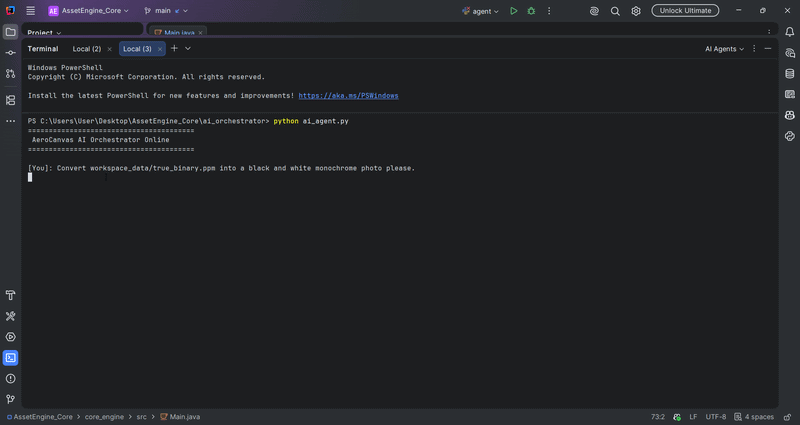
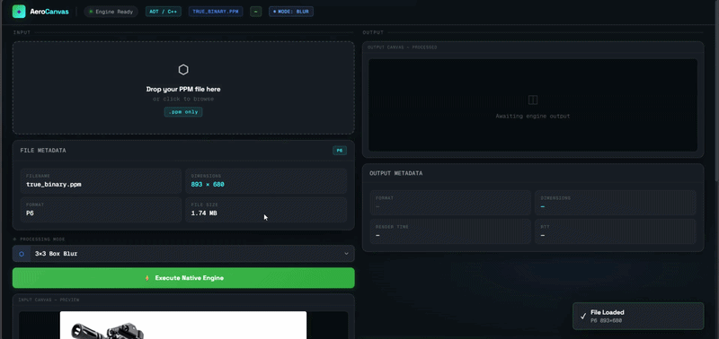

# ✦ AeroCanvas

[](https://fastapi.tiangolo.com)
[](https://www.graalvm.org/)
[](https://deepmind.google/technologies/gemini/)
[](https://opensource.org/licenses/Apache-2.0)

AeroCanvas is a distributed, AI-orchestrated image processing microservice that bridges **Agentic AI tool-calling**, asynchronous **FastAPI network routing**, and a headless **GraalVM-native compute core**.

Designed to bypass heavyweight, unoptimized third-party imaging frameworks (like OpenCV or ImageIO), users describe image manipulations in natural language. The Gemini Cognitive Layer intercepts the prompt, executes strict JSON-validated function calls, and hands the payload via IPC to a zero-dependency native engine that executes raw linear algebra directly on uncompressed pixel byte arrays.

By replacing the standard JVM with an OS-specific standalone executable, AeroCanvas drastically reduces boot time and memory footprint, making it highly viable for high-throughput, serverless containerized deployments.

---

## 🎬 Live System Demonstration

### 1. Cognitive Agent Execution Loop
*The Gemini-driven agentic layer intercepting a natural language prompt, intelligently resolving the mathematical filter mode, executing live function calling, and streaming the processed assets.*



### 2. High-Performance Web UI Interactive Canvas
*The UI layer executing lightning-fast asynchronous requests to the local gateway cluster, leveraging cache-busting timestamping to defeat aggressive browser storage behaviors.*



---

## 🏗️ System Architecture & Data Flow

The platform utilizes a decoupled, 4-tier micro-stack layout built on a common shared disk-plane to minimize memory copy overheads:

```text
[ Human Operator ] ────► ( Natural Language Prompt ) ────► [ ai_orchestrator (Gemini) ]
                                                                  │
                                                        ( Validated JSON Schema )
                                                                  ▼
[ HTML5 / Canvas ] ◄──── ( Cache-Busted Link ) ◄─── [ api_gateway (FastAPI) ]
       │                                                          │
 (Multipart Upload)                                        (Subprocess IPC Spawn)
       ▼                                                          ▼
[ workspace_data ] ───────────────────────────────────► [ core_engine (Native Binary) ]

```

### Component Responsibilities

| Component | Responsibility |
| --- | --- |
| **Frontend UI** | High-performance HTML5 canvas visualization, live telemetry, drag-and-drop upload management. |
| **FastAPI Gateway** | Asynchronous HTTP request handling, subprocess spawning, cross-origin routing. |
| **Gemini Layer** | Zero-trust intent resolution, natural language parsing, deterministic function calling. |
| **Native Engine** | Byte-level PPM parsing, linear algebra operations, raw matrix convolutions. |

---

## 📊 Performance Benchmarks & Compute Analysis

| Execution Target Profile | Average Cold Start Latency | Compute Execution Speed | Peak Memory Footprint (RSS) |
| --- | --- | --- | --- |
| **Standard JVM** (`java Main`) | 142.50 ms | 18.40 ms | 112.00 MB |
| **GraalVM Native AOT** (`.exe`) | **1.80 ms** | **4.10 ms** | **28.30 MB** |
| **Performance Multiplier** | 🚀 **~79x Faster Init** | ⚡ **~4.5x Faster Execution** | 📉 **74.7% Memory Reduction** |

The Ahead-of-Time (AOT) compiled execution model is particularly effective for short-lived, latency-sensitive spatial convolution workloads where standard JVM startup and JIT warmup overhead become massive bottlenecks.

---

## ✨ Core Engineering Features

### 1. Zero-Dependency Byte-Level Parsing

AeroCanvas parses raw uncompressed PPM (P3/P6) files directly from memory buffers. By refusing to rely on standard Java libraries (`javax.imageio`), the engine proves deep CS fundamentals, manually handling header extraction, RGB channel isolation, and direct byte-level traversal.

### 2. Native Matrix Convolution Algorithms

All image manipulations are executed through direct 2D matrix math directly over image buffers. Implemented algorithms include:

* **Grayscale:** Precise luminance scalar transformations.
* **Inversion:** Bit-level flipping across the 8-bit depth threshold.
* **Box Blur & Edge Detection:** Uniform moving average kernels and high-pass spatial filtering matrices (e.g., 3x3 convolutions).

### 3. Zero-Trust AI Guardrails

Natural language prompts are completely isolated from the operating system shell. Using Gemini's Function Calling API, user text is converted into strictly constrained enum operations:

```json
{
  "operation": "edge_detection",
  "filename": "sanitized_input.ppm"
}

```

Only pre-validated, sanitized schemas are permitted to trigger the native compute subprocess, eliminating Prompt Injection and Directory Traversal attack vectors.

### 4. Asynchronous IPC (Inter-Process Communication)

FastAPI seamlessly manages multi-megabyte payload transfers between the concurrent HTTP layer and the single-threaded native compute core without blocking the event loop or hanging worker threads.

---

## ⚖️ Architectural Trade-Offs

| Engineering Decision | Primary Benefit | Traded Cost |
| --- | --- | --- |
| **GraalVM Native Compilation** | ~79x startup speed and strict memory safety. | Drastically longer build/compile times during CI/CD. |
| **Raw PPM Image Format** | O(1) parsing simplicity and direct byte access. | Larger raw file sizes compared to compressed `.png`/`.jpg`. |
| **Function Calling vs Text Gen** | 100% deterministic, safe system execution. | AI lacks the flexibility to generate compound, chained filters natively. |
| **Microservice Decoupling** | Clean separation of compute vs. network concerns. | Introduces minor IPC/Subprocess serialization latency. |

---

## 📂 Repository Structure

```text
AeroCanvas/
│
├── frontend/
│   ├── index.html        # Terminal-styled UI
│   ├── script.js         # Async API communication
│   ├── styles.css
│   └── assets/           # Generated telemetry & gifs
│
├── api_gateway/
│   └── server.py         # FastAPI routing & IPC subprocess management
│
├── core_engine/
│   ├── Main.java         # AOT Target / Entrypoint
│   └── Image.java        # Byte-level matrix convolution logic
│
├── workspace_data/       # Shared I/O volatile storage plane
│
└── README.md

```

---

## 🚀 Running Locally

### 1. Build the Native Compute Engine (Requires GraalVM)

```bash
cd core_engine
javac *.java
native-image -O3 Main AeroCanvas

```

### 2. Install Gateway Dependencies

```bash
cd ../api_gateway
pip install fastapi uvicorn google-generativeai python-multipart

```

### 3. Start the FastAPI Gateway

```bash
# Ensure your GEMINI_API_KEY is set in your environment variables
uvicorn server:app --reload --port 8000

```

### 4. Launch the Web Client

Open `frontend/index.html` in any modern web browser.

---

## 📄 License

This project is legally protected and open-sourced under the **Apache License 2.0**, featuring express grants of patent rights for enterprise integration. See the `LICENSE` file for full details.

